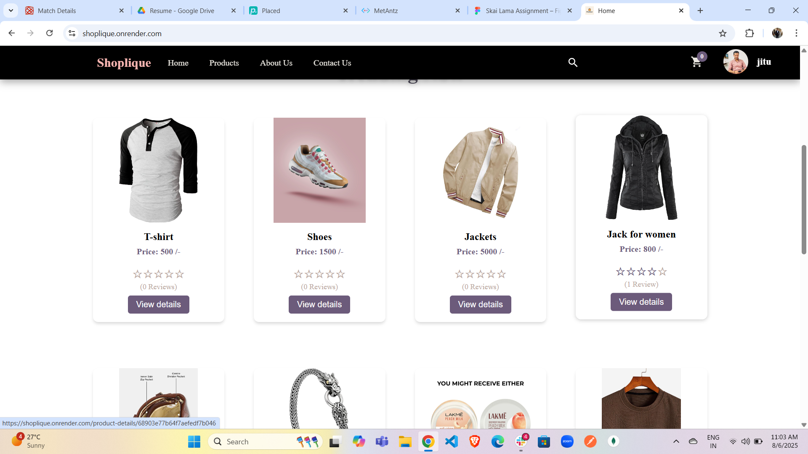
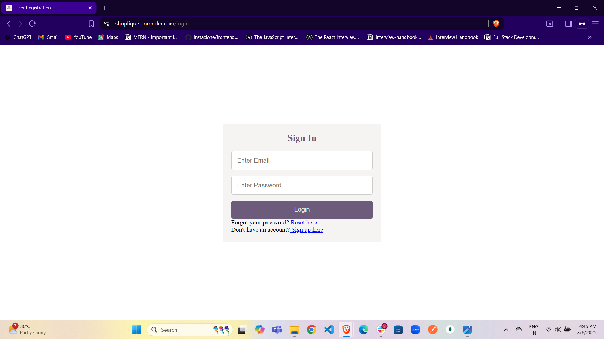
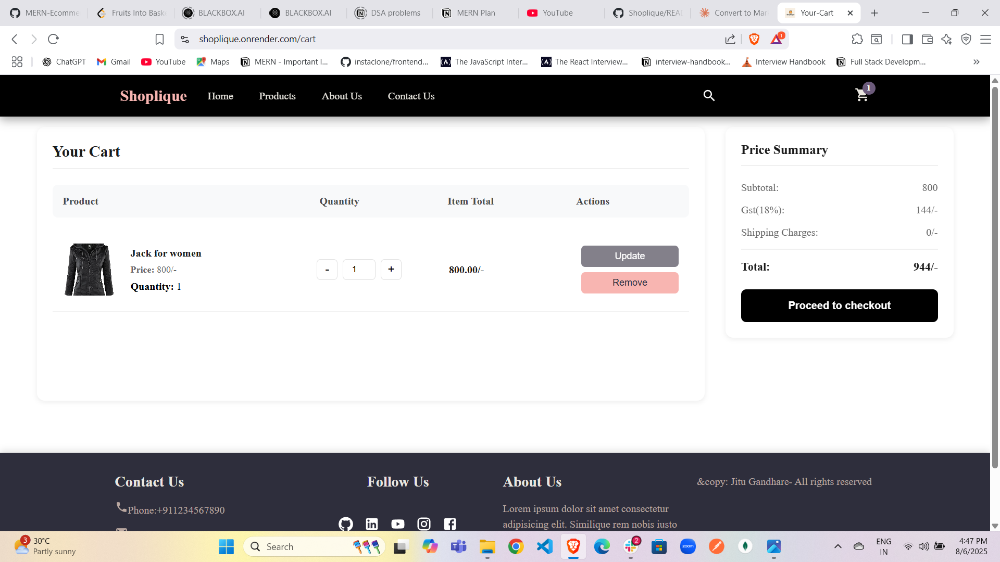
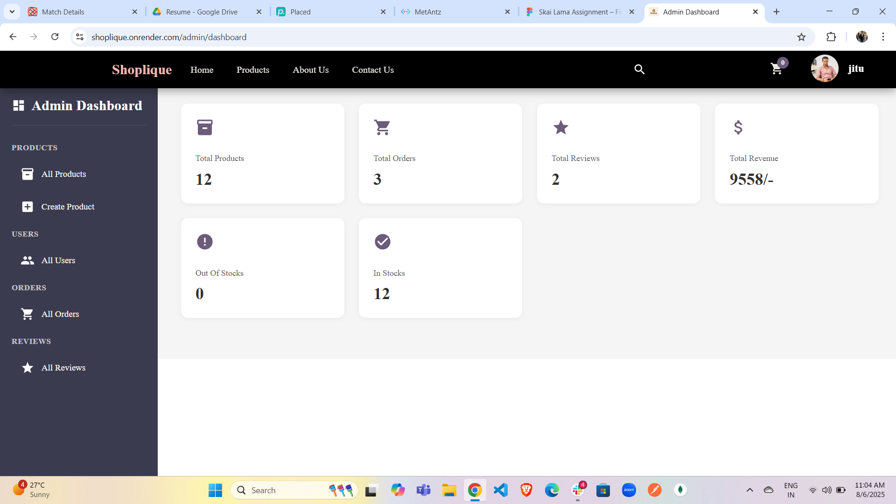

# 🛍️ Shoplique – MERN Stack E-commerce Application

**Live Demo:** [Shoplique Live](https://shoplique.onrender.com/)

Shoplique is a full-featured e-commerce web application built with the **MERN stack** (MongoDB, Express.js, React.js, Node.js). It provides a smooth and secure shopping experience for users and a comprehensive admin panel for managing the platform.

---

## 📸 Screenshots

### 🏠 Home Page


### 🛒 Product Page





### 👤 Login Page




### 🛍️ Cart Page




### 📦 Admin Dashboard




---

## 🧭 Project Overview

Shoplique supports both **user** and **admin** roles. Users can register, browse products, manage orders, and make payments. Admins have full control over product listings, users, and reviews.

---

## 🚀 Key Features

### 👥 User Features
- 🔐 **Authentication:** Sign up, login, logout, password reset/update.
- 🛍️ **Product Browsing:** Filter by category, price, and rating.
- 🛒 **Cart System:** Add/remove products, cart summary, and checkout.
- 📦 **Order Management:** Place orders, track status, and view order history.
- ⭐ **Product Reviews:** Add, edit, and delete reviews.
- 💳 **Payments:** Razorpay integration for secure checkout.

### 🛠️ Admin Features
- 📦 **Product Management:** Create, update, and delete products.
- 👤 **User Management:** View/edit users, assign admin roles.
- 💬 **Review Moderation:** Edit or delete any product review.

---

## 🧑‍💻 Tech Stack

| Technology     | Description                        |
|----------------|------------------------------------|
| **Frontend**   | React.js, Redux Toolkit, React Router |
| **Backend**    | Node.js, Express.js                |
| **Database**   | MongoDB (Mongoose)                 |
| **Auth**       | JWT (JSON Web Token)               |
| **Payments**   | Razorpay Integration               |
| **Storage**    | `localStorage` & `sessionStorage`  |

---

## 🛠️ Installation Guide

Clone the repository:

```bash
git clone https://github.com/Jitugandhare/Shoplique.git
cd Shoplique
```

### 🔧 Backend Setup

```bash
cd backend
npm install
```

Create a `.env` file in the `/backend` directory and add:

```env
PORT=5000
MONGO_URI=your_mongodb_connection_string
JWT_SECRET=your_jwt_secret
RAZORPAY_KEY_ID=your_razorpay_key_id
RAZORPAY_SECRET=your_razorpay_secret
```

Run the server:

```bash
npm run dev
```

### 🎨 Frontend Setup

```bash
cd frontend
npm install
npm start
```

Visit: http://localhost:5173

---

## 📁 Folder Structure

```
Shoplique/
├── backend/
│   ├── controllers/
│   ├── models/
│   ├── routes/
│   └── server.js
├── frontend/
│   ├── components/
│   ├── pages/
│   └── App.js
├── .env
├── README.md
└── package.json
```

---

## 🛡️ Security Features

- Password hashing using bcryptjs
- JWT-based authentication
- Role-based access control (User/Admin)
- Secure payment with Razorpay

---

## 📌 Future Improvements

- Implement product wishlists
- Add product recommendations
- Add coupon and discount system
- Enable social login (Google/Facebook)

---

## 🤝 Contribution

Feel free to fork this project, raise issues, and contribute with PRs.

---

## 📃 License

This project is licensed under the MIT License.

---

## 🙋‍♂️ Author

Made with ❤️ by Jitu Gandhare  
GitHub: [@Jitugandhare](https://github.com/Jitugandhare)


